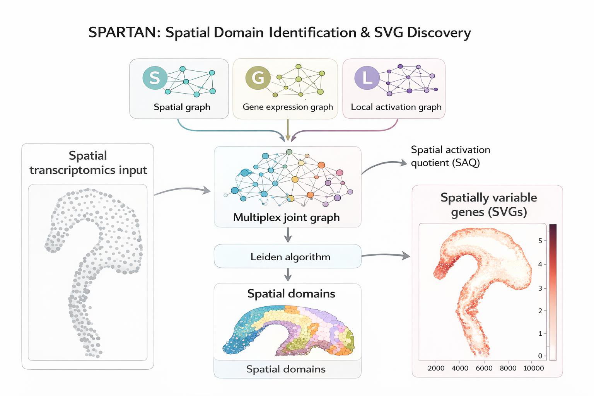

<p align="center">
  
</p>

<p align="center">
  
</p>

<p align="center">
  <a href="https://github.com/MohammadFaizIqbalFaiz/spartan-st">
    
    

  </a>
  <a href="LICENSE">
    
  </a>
</p>

<p align="center">
  <em>Conceptual overview of Spartan for spatial domain identification and spatially variable gene discovery.</em>
</p>

# Spartan

**Spartan** (Spatial Activation–Aware Transcriptomic Analysis Network) is a Python toolkit
for **spatial domain identification** and **spatially variable gene (SVG) discovery**
in spatial transcriptomics data.

Spartan integrates spatial proximity, gene expression connectivity, and **local spatial
activation (LSA)**, a neighborhood-dependent spatial autocorrelation signal,
to resolve biologically coherent tissue domains and identify genes associated with
localized spatial structure.

---

## Conceptual overview

Most spatial clustering methods rely on two signals:
(1) physical proximity and (2) transcriptomic similarity.
Spartan introduces a third signal, **local spatial activation (LSA)**, which quantifies
how strongly a spot’s molecular state deviates from its local neighborhood.

Spartan constructs three graphs:

1. **Spatial graph (S)** — physical proximity  
2. **Gene expression connectivity graph (G)** — transcriptomic similarity (PCA space)  
3. **Local spatial activation graph (L)** — neighborhood-dependent spatial autocorrelation  

These graphs are combined into a **multiplex joint graph**, which is partitioned using
the Leiden algorithm to identify **spatial domains**.
The same activation signal is used to compute a **Spatial Activation Quotient (SAQ)**
for robust detection of **spatially variable genes**.

---

## Key features

- Multiplex graph-based spatial domain identification
- Explicit modeling of local spatial activation
- Robust SVG discovery using the Spatial Activation Quotient (SAQ)
- Scanpy-style API (`spartan.tl`, `spartan.pl`)
- Compatible with AnnData and SpatialData frameworks
- Scales across sequencing- and imaging-based technologies

---

## Installation

### Recommended (conda, from source)

```bash
conda env create -f envs/environment.core.yml
conda activate spartan-core
pip install .
```

### Reproduce paper results (reviewers)

```bash
mamba env create -f envs/environment.paper.lock.yml
mamba activate biogis
```

---

## Quickstart (AnnData)

```python
import spartan as sp

sp.tl.spartan_spatial_domains(
    adata,
    key_added="spartan_domains",
)

adata.obs["spartan_domains"].value_counts()

sp.tl.spartan_svg(
    adata,
    lsa_graph=adata.obsp["spartan_lsa_graph"],
)

adata.var.sort_values("spartan_saq", ascending=False).head(10)
```

---

## Outputs

### Spatial domains
- `adata.obs["spartan_domains"]` — spatial domain labels

### Graphs (`adata.obsp`)
- `spartan_spatial_graph`
- `spartan_spatial_weights`
- `spartan_lsa_graph`
- `spartan_gene_graph`
- `spartan_joint_graph`

### Spatially variable genes
- `spartan_saq`
- `spartan_saq_pval`
- `spartan_saq_fdr`
- `spartan_svg`
- `spartan_saq_rank`

---

## Core API

### `spartan_spatial_domains`

```python
sp.tl.spartan_spatial_domains(
    adata,
    spatial_coord="grid",
    spatial_neighborhood="knn",
    spatial_neighs=6,
    spatial_rings=2,
    total_pca_comps=50,
    pca_comps_extract=30,
    gene_neighs=15,
    alpha=0.8,
    beta1=0.1,
    beta2=0.4,
    resolution=1.0,
    seed=1,
    key_added="spartan_domains",
)
```

**Key parameters**
- `spatial_coord`: `"grid"` (Visium/HD) or `"generic"` (MERFISH)
- `spatial_neighborhood`: `"knn"` or `"delaunay"`
- `alpha`: balances spatial/LSA vs gene expression
- `beta1`, `beta2`: weights for LSA and spatial graphs (`beta1 + beta2 = 0.5`)
- `resolution`: Leiden resolution parameter

Updates `adata` in place and stores graphs in `adata.obsp`.

---

### `spartan_svg`

```python
sp.tl.spartan_svg(
    adata,
    lsa_graph,
    n_permutations=1000,
    fdr_threshold=0.05,
    seed=1,
)
```

Adds SAQ statistics to `adata.var`.

---

## Tested environment

- numpy 2.2.6
- scipy 1.15.2
- anndata 0.11.4
- scanpy 1.11.4
- squidpy 1.6.5
- igraph 0.11.8
- leidenalg 0.10.2
- joblib 1.5.1
- statsmodels 0.14.5
- matplotlib 3.10.5
- spatialdata 0.4.0

For exact reproducibility, use `envs/environment.paper.lock.yml`.
