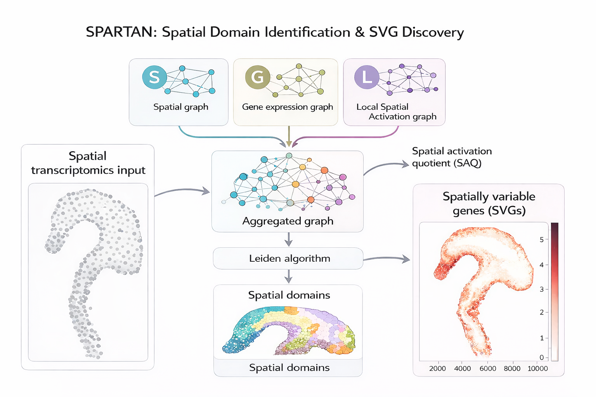
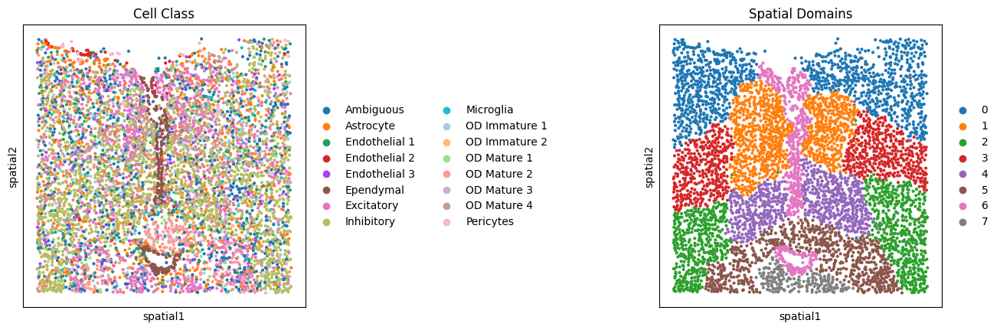
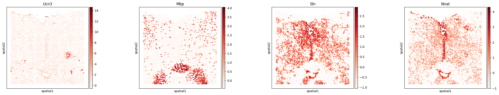

<p align="center">
  
</p>

<p align="center">
  
</p>

<p align="center">
  <a href="https://github.com/MohammadFaizIqbalFaiz/spartan-st">
    
    

  </a>
  <a href="LICENSE">
    
  </a>
</p>

<p align="center">
  <em>Conceptual overview of Spartan for spatial domain identification and spatially variable gene discovery.</em>
</p>


---
## Spartan

**Spartan** is an activation-aware spatial transcriptomics framework for spatial domain identification and spatially variable gene discovery.

Spartan integrates spatial topology, gene expression connectivity, and Local Spatial Activation (LSA) into an aggregated graph for unsupervised spatial domain detection. The framework is designed for multiple spatial transcriptomics technologies, including imaging-based datasets such as MERFISH, sequencing-based datasets such as Stereo-seq, and high-resolution platforms such as Visium HD. Spartan can operate on both classic `AnnData` and next-generation spatial omics, `SpatialData` frameworks. 

---

## Overview

Spatial transcriptomics datasets contain both molecular and spatial information. Many spatial clustering approaches primarily model local similarity or spatial smoothing. Spartan instead introduces a Local Spatial Activation graph that captures neighborhood-conditioned transcriptional deviation across spatial neighborhoods.

Spartan constructs three complementary graphs:

- **Spatial graph (`S`)** — captures physical neighborhood topology.
- **Gene expression connectivity graph (`G`)** — captures transcriptomic similarity in reduced expression space.
- **Local Spatial Activation graph (`L`)** — captures local transcriptional activation/deviation structure across spatial neighborhoods.

These graphs are combined into an aggregated graph:

```math
J = (\alpha-\beta_1)L + (1-\alpha)G + (\alpha-\beta_2)S
```

Leiden clustering is then applied to the aggregated graph to identify spatial domains.

Spartan also provides a Spatial Activation Quotient (SAQ) workflow for identifying spatially variable genes using the LSA graph.

---

## Installation

### General package environment

For general users, create the lightweight Spartan environment:

```bash
conda env create -f envs/environment.core.yml
conda activate spartan-core
pip install -e .
```

### Paper reproducibility environment

For exact reproduction of manuscript analyses and tutorial notebooks:

```bash
conda env create -f envs/environment.paper.lock.yml
conda activate spartan-paperS
pip install -e .
```

The paper environment contains the pinned package versions used for the manuscript analyses.

---

## Quickstart tutorial

This quickstart is intended for new Spartan users. It demonstrates a minimal end-to-end workflow using the representative MERFISH dataset available from Squidpy. The workflow loads one MERFISH section, preprocesses the data, identifies Spartan spatial domains, runs SAQ-based spatially variable gene discovery, and visualizes both spatial domains and representative SVGs.

---

### 1. Import packages and load a MERFISH sample

```python
import spartan as sp
import squidpy as sq
import scanpy as sc
import matplotlib.pyplot as plt

adata_data = sq.datasets.merfish()  # representative MERFISH dataset from Squidpy

# Extract one sample/section
adata = adata_data[adata_data.obs["Bregma"] == 1].copy()
```

---

### 2. Add a ground-truth column if needed

Some Spartan workflows and tutorials expect a `ground_truth` column for downstream benchmarking or visualization. The core Spartan domain workflow itself does not require ground-truth labels.

```python
# If a ground-truth column is absent, initialize one
adata.obs["ground_truth"] = ""
```

---

### 3. Preprocess the imaging-based dataset

For MERFISH and related imaging-based spatial transcriptomics datasets, use the imaging preprocessing wrapper. To use this wrapper, ground_truth column is needed, create one using code snippet in 2.

```python
adata = sp.tl.pre_process_imaging(adata)
```

---

### 4. Run Spartan spatial domain identification

This step constructs the spatial graph, Local Spatial Activation graph, gene-expression connectivity graph, aggregated Spartan graph, and then applies Leiden clustering to identify spatial domains.

```python
sp.tl.spartan_spatial_domains(
    adata,
    spatial_coord="generic",
    spatial_neighborhood="knn",
    spatial_neighs=10,
    gene_neighs=15,
    alpha=0.69,
    beta1=0.26,
    beta2=0.24,
    resolution=0.61,
    seed=1,
    key_added="spartan_domains",
)
```

The predicted spatial domains are stored in:

```python
adata.obs["spartan_domains"]
```

Inspect the number of cells assigned to each Spartan domain:

```python
adata.obs["spartan_domains"].value_counts()
```

---

### 5. Run SAQ-based spatially variable gene discovery

Spartan uses the Local Spatial Activation graph to compute Spatial Activation Quotient scores for spatially variable gene discovery.

```python
sp.tl.spartan_svg(
    adata,
    lsa_graph=adata.obsp["spartan_lsa_graph"],
    top_k_refine=161,
    key_added="spartan_svg",
)
```

View the top SAQ-ranked genes:

```python
adata.var.sort_values("spartan_saq", ascending=False).head(10)
```

---

### 6. Visualize cell classes and Spartan spatial domains

```python
sc.pl.spatial(
    adata,
    img_key=None,
    color=["Cell_class", "spartan_domains"],
    wspace=0.4,
    title=["Cell Class", "Spatial Domains"],
    size=2.5,
    spot_size=0.005,
)
```

Example output:



---

### 7. Visualize representative Spartan SVGs

```python
genes = ["Ucn3", "Mbp", "Sln", "Nnat"]

sc.pl.spatial(
    adata,
    img_key=None,
    color=genes,
    color_map="Reds",
    size=2.5,
    spot_size=0.005,
    legend_loc=None,
)
```

Example output:



---

### 8. Main objects created by the quickstart

After running the quickstart, Spartan stores the main outputs inside the `AnnData` object.

Spatial domain labels:

```python
adata.obs["spartan_domains"]
```

Graph outputs:

```python
adata.obsp["spartan_spatial_graph"]
adata.obsp["spartan_spatial_weights"]
adata.obsp["spartan_lsa_graph"]
adata.obsp["spartan_gene_graph"]
adata.obsp["spartan_joint_graph"]
```

SAQ/SVG outputs:

```python
adata.var["spartan_saq"]
adata.var["spartan_saq_pval"]
adata.var["spartan_saq_fdr"]
adata.var["spartan_svg"]
adata.var["spartan_saq_rank"]
```

---

### Complete quickstart code

```python
import spartan as sp
import squidpy as sq
import scanpy as sc
import matplotlib.pyplot as plt

adata_data = sq.datasets.merfish()
adata = adata_data[adata_data.obs["Bregma"] == 1].copy()

adata.obs["ground_truth"] = ""

adata = sp.tl.pre_process_imaging(adata)

sp.tl.spartan_spatial_domains(
    adata,
    spatial_coord="generic",
    spatial_neighborhood="knn",
    spatial_neighs=10,
    gene_neighs=15,
    alpha=0.69,
    beta1=0.26,
    beta2=0.24,
    resolution=0.61,
    seed=1,
    key_added="spartan_domains",
)

adata.obs["spartan_domains"].value_counts()

sp.tl.spartan_svg(
    adata,
    lsa_graph=adata.obsp["spartan_lsa_graph"],
    top_k_refine=161,
    key_added="spartan_svg",
)

adata.var.sort_values("spartan_saq", ascending=False).head(10)

sc.pl.spatial(
    adata,
    img_key=None,
    color=["Cell_class", "spartan_domains"],
    wspace=0.4,
    title=["Cell Class", "Spatial Domains"],
    size=2.5,
    spot_size=0.005,
)

genes = ["Ucn3", "Mbp", "Sln", "Nnat"]

sc.pl.spatial(
    adata,
    img_key=None,
    color=genes,
    color_map="Reds",
    size=2.5,
    spot_size=0.005,
    legend_loc=None,
)
```
For sequencing-based spatial transcriptomics, use:

```python
adata = sp.tl.pre_process_sequencing(adata)
```

---

## Main outputs

### Spatial domains

Spartan stores predicted spatial domain labels in:

```python
adata.obs["spartan_domains"]
```

or in the user-defined column specified by `key_added`.

### Graphs stored in `adata.obsp`

Spartan stores the graph components used for spatial domain detection:

| Key | Description |
|---|---|
| `spartan_spatial_graph` | Spatial neighborhood adjacency graph |
| `spartan_spatial_weights` | Row-normalized spatial weight matrix |
| `spartan_lsa_graph` | Local Spatial Activation graph |
| `spartan_gene_graph` | Gene expression connectivity graph |
| `spartan_joint_graph` | Aggregated graph used for Leiden clustering |

### Spatially variable gene outputs

The SAQ/SVG workflow stores gene-level statistics in `adata.var`:

| Key | Description |
|---|---|
| `spartan_saq` | Spatial Activation Quotient score |
| `spartan_saq_pval` | SAQ p-value |
| `spartan_saq_fdr` | Benjamini–Hochberg adjusted FDR |
| `spartan_svg` | Boolean SVG calls |
| `spartan_saq_rank` | Gene ranking by SAQ score |

---

## Core user-facing API

### Preprocessing

#### `pre_process_imaging`

```python
adata = sp.tl.pre_process_imaging(adata)
```

Preprocesses imaging-based spatial transcriptomics datasets such as MERFISH and Vizgen MERFISH.

This workflow is intended for single-cell imaging datasets, where measured genes are typically retained and standard normalization/log transformation is applied before graph construction.

#### `pre_process_sequencing`

```python
adata = sp.tl.pre_process_sequencing(adata)
```

Preprocesses sequencing-based spatial transcriptomics datasets such as Stereo-seq, Visium, and Visium HD.

This workflow can include filtering, normalization, log transformation, highly variable gene selection, scaling, and PCA-compatible preparation.

---

## Spatial domain identification

### `spartan_spatial_domains`

```python
sp.tl.spartan_spatial_domains(
    adata,
    spatial_coord="grid",
    spatial_neighs=6,
    spatial_rings=2,
    spatial_neighborhood="knn",
    total_pca_comps=50,
    pca_comps_extract=30,
    gene_coord="generic",
    gene_neighs=15,
    alpha=0.80,
    beta1=0.10,
    beta2=0.40,
    resolution=1.0,
    seed=1,
    key_added="spartan_domains",
    copy=False,
)
```

Runs the complete Spartan spatial domain workflow:

1. Constructs the spatial graph `S`.
2. Constructs the Local Spatial Activation graph `L`.
3. Constructs the gene expression connectivity graph `G`.
4. Forms the aggregated graph `J`.
5. Runs Leiden clustering.
6. Stores spatial domains in `adata.obs[key_added]`.

The aggregated graph is:

```math
J = (\alpha-\beta_1)L + (1-\alpha)G + (\alpha-\beta_2)S
```

where:

- `L` is the Local Spatial Activation graph,
- `G` is the gene expression connectivity graph,
- `S` is the spatial adjacency graph.

### Key parameters

| Parameter | Description |
|---|---|
| `spatial_coord` | Coordinate mode used by Squidpy. Common values are `"grid"` for Visium-like data and `"generic"` for single-cell imaging data. |
| `spatial_neighborhood` | Spatial graph construction method: `"knn"` or `"delaunay"`. |
| `spatial_neighs` | Number of spatial neighbors for KNN-based spatial graph construction. |
| `spatial_rings` | Number of spatial rings for grid-based datasets. |
| `total_pca_comps` | Total number of principal components computed. |
| `pca_comps_extract` | Number of principal components used for graph construction. |
| `gene_coord` | Coordinate mode used for gene expression graph construction. |
| `gene_neighs` | Number of neighbors for the gene expression connectivity graph. |
| `alpha` | Graph integration parameter controlling the balance between activation/spatial structure and expression connectivity. |
| `beta1` | Offset controlling the effective LSA graph contribution. |
| `beta2` | Offset controlling the effective spatial graph contribution. |
| `resolution` | Leiden resolution parameter controlling clustering granularity. |
| `seed` | Random seed for reproducibility. |
| `key_added` | Column name used to store Spartan domain labels in `adata.obs`. |
| `copy` | If `True`, returns a modified copy of `adata`; otherwise updates `adata` in place. |

By default, `beta1 + beta2 = 0.5`.

---
## Recommended parameter settings

The table below provides suggested starting settings for major spatial transcriptomics technologies. These values are intended as practical defaults for new users and can be adjusted depending on tissue complexity, dataset size, spatial resolution, and desired spatial domain granularity.

| Technology | `spatial_coord` | `spatial_neighborhood` | `spatial_neighs` | `spatial_rings` | `gene_coord` | `gene_neighs` | Suggested `alpha` | Suggested `beta1` | Suggested `beta2` | Notes |
|---|---|---|---:|---:|---|---:|---|---|---|---|
| Visium HD | `grid` | `knn` | 4–6 | 2 | `generic` | 15 | 0.70–0.80 | 0.10–0.26 | 0.24–0.40 | Use higher `alpha` values for large high-resolution datasets. For microstructure detection, explore lower `beta1` values to increase the effective LSA contribution. |
| MERFISH | `generic` | `knn` | 10–12 | NA | `generic` | 15 | 0.69–0.82 | 0.10–0.26 | 0.24–0.40 | Recommended for single-cell imaging datasets. Use higher `alpha` values when local spatial activation is expected to be highly informative. |
| MERFISH | `generic` | `delaunay` | NA | NA | `generic` | 15 | 0.75–0.85 | 0.10–0.26 | 0.24–0.40 | Delaunay graph construction can be useful for imaging-based single-cell datasets with irregular spatial layouts. |
| Stereo-seq | `grid` | `knn` | 4 | 1 | `generic` | 15 | 0.50–0.60 | 0.26 | 0.24 | Sequencing-based datasets often stabilize at lower `alpha` values, reflecting a more balanced contribution of LSA, spatial adjacency, and gene-expression connectivity. |
| Visium SD | `grid` | `knn` | 6 | 2 | `generic` | 15 | 0.55–0.75 | 0.26 | 0.24 | Standard Visium spot-level datasets generally benefit from moderate `alpha` values. |

### Parameter notes

The recommended settings above are starting points, not strict rules. Users can adjust parameters depending on the biological question and dataset resolution.

The following parameters are especially useful to tune:

| Parameter | Default | Description |
|---|---:|---|
| `gene_neighs` | 15 | Number of neighbors used to construct the gene-expression connectivity graph. |
| `total_pca_comps` | 50 | Total number of principal components computed during PCA. |
| `pca_comps_extract` | 30 | Number of principal components used for graph construction. |

A good default setting for most datasets is:

```python
gene_neighs = 15
total_pca_comps = 50
pca_comps_extract = 30
```
## Graph construction only

### `spartan_build_graphs`

```python
sp.tl.spartan_build_graphs(
    adata,
    spatial_coord="grid",
    spatial_neighs=6,
    spatial_rings=2,
    spatial_neighborhood="knn",
    total_pca_comps=50,
    pca_comps_extract=30,
    gene_coord="generic",
    gene_neighs=15,
    seed=1,
    copy=False,
)
```

Builds and stores Spartan graph components without running Leiden clustering.

This is useful for:

- inspecting graph structure,
- running custom parameter sweeps,
- alpha-selection workflows,
- reusing precomputed graphs,
- separating graph construction from clustering.

The function stores:

```python
adata.obsp["spartan_spatial_graph"]
adata.obsp["spartan_spatial_weights"]
adata.obsp["spartan_lsa_graph"]
adata.obsp["spartan_gene_graph"]
```

---

## Alpha-selection and operating-regime analysis

Spartan includes utilities for evaluating dataset-level graph integration regimes across alpha and resolution values.

These workflows are intended for **benchmarking-oriented analysis** when ground-truth annotations are available. Metrics such as NMI, homogeneity, and completeness are used to characterize stable operating regimes.

Importantly, Spartan spatial domain detection itself remains unsupervised: graph construction, graph integration, Leiden clustering, and nLSAS-based pruning do not use ground-truth labels.

### `initiate_alpha_selection`

```python
summary_df, results_df = sp.tl.initiate_alpha_selection(
    adata,
    lower_alpha=0.50,
    upper_alpha=0.90,
    step_alpha=0.01,
    lower_resolution=0.50,
    upper_resolution=2.00,
    step_resolution=0.05,
    ground_truth="ground_truth",
    config="lsg",
    seed=1,
)
```

Performs alpha and resolution analysis for a given graph-integration configuration.

The workflow can be used to evaluate stable dataset-level alpha regimes rather than isolated sample-specific optima.

### `consensus_alpha`

```python
alpha_star = sp.tl.consensus_alpha(summary_df)
```

Computes a dataset-level consensus alpha from alpha-selection summaries.

### nLSAS-based pruning

Spartan supports nLSAS-based filtering of candidate configurations after graph construction and clustering.

nLSAS is used as an unsupervised stability/coherence criterion to reduce the configuration space before downstream benchmarking and visualization.

Ground-truth labels are not used in nLSAS pruning.

---

## Spatially variable gene discovery

### `spartan_svg`

```python
sp.tl.spartan_svg(
    adata,
    lsa_graph=adata.obsp["spartan_lsa_graph"],
    layer="log1pX",
    n_permutations=1000,
    n_cores=8,
    alpha_svg=0.05,
    chunk_size=200,
    seed=1,
    key_added="spartan_svg",
    copy=False,
)
```

Runs Spartan spatially variable gene discovery using the Spatial Activation Quotient (SAQ).

SAQ measures how strongly each gene aligns with the Local Spatial Activation graph.

The function stores the following columns in `adata.var`:

```python
adata.var["spartan_saq"]
adata.var["spartan_saq_pval"]
adata.var["spartan_saq_fdr"]
adata.var["spartan_svg"]
adata.var["spartan_saq_rank"]
```

---

## Plotting API

Spartan provides lightweight plotting helpers in `spartan.pl`.

### Spatial domains

```python
sp.pl.spatial_domains(
    adata,
    color="spartan_domains",
)
```

### SVG table

```python
sp.pl.svg_table(
    adata,
    n=20,
)
```

For publication-quality plots, Spartan outputs can also be visualized using Scanpy, Squidpy, Matplotlib, or SpatialData plotting utilities.

---

## Tutorial notebooks

Reviewer-oriented tutorial notebooks are available in the [`tutorials/`](tutorials) directory.

| Notebook | Description |
|---|---|
| `ImagingBasedSpartan.ipynb` | MERFISH imaging-based workflow tutorial |
| `SequencingBasedSpartan.ipynb` | Stereo-seq sequencing-based workflow tutorial |
| `VisiumHDAnalysis Using Spartan.ipynb` | High-resolution Visium HD analysis and main figure reproduction |
| `SpartanSVGDiscovery.ipynb` | Spartan's SVG discovery results and main figure reproduction |

These notebooks demonstrate:

- imaging-based spatial domain analysis,
- sequencing-based spatial domain analysis,
- high-resolution Visium HD biological interpretation,
- dataset-level alpha operating-regime analysis,
- nLSAS-based configuration filtering,
- reproduction of key manuscript analyses and figure panels.
- Spartan's SVG discovery utility across diverse spatially resolved transcriptomics technologies.

---

## Reproducibility

Spartan provides two environments:

### General user environment

```bash
conda env create -f envs/environment.core.yml
conda activate spartan-core
pip install -e .
```

### Paper reproduction environment

```bash
conda env create -f envs/environment.paper.lock.yml
conda activate spartan-paperS
pip install -e .
```

The paper-lock environment is intended for reproducing manuscript analyses and tutorial notebooks.

---

## Tested environment

The core package has been tested with:

- numpy 2.2.6
- scipy 1.15.2
- anndata 0.11.4
- scanpy 1.11.4
- squidpy 1.6.5
- igraph 0.11.8
- leidenalg 0.10.2
- joblib 1.5.1
- statsmodels 0.14.5
- matplotlib 3.10.5
- spatialdata 0.4.0

---

## Citation

If you use Spartan, please cite:

```bibtex
@article {Faiz2026.02.18.706570,
	author = {Faiz, Mohammad Faiz Iqbal and Jokl, Elliot and Jennings, Rachel and Piper Hanley, Karen and Sharrocks, Andrew and Iqbal, Mudassar and Baker, Syed Murtuza},
	title = {Spartan: activation-aware framework for spatial domain and variable gene discovery},
	elocation-id = {2026.02.18.706570},
	year = {2026},
	doi = {10.64898/2026.02.18.706570},
	publisher = {Cold Spring Harbor Laboratory},
	abstract = {Spatial transcriptomics is rapidly advancing toward single-cell-level resolution, revealing complex tissue architectures organized across continuous anatomical gradients. However, accurate identification of spatial domains remains a central computational challenge, as many existing clustering approaches blur anatomical boundaries, merge transitional zones, or fail to resolve localized microstructures. Here we introduce Spartan, an activation-aware multiplex graph framework for high-resolution domain discovery. Spartan integrates spatial topology and Local Spatial Activation (LSA), a neighborhood deviation signal that captures localized transcriptional heterogeneity often attenuated by similarity-based clustering. By jointly modeling cohesion within domains and localized activation structure, Spartan recovers anatomically aligned partitions across spatially resolved transcriptomics technologies including Visium HD, MERFISH, Stereo-seq, and STARmap. We further demonstrate its utility in a high-resolution Visium HD section of developing human esophagus and stomach, where activation-aware graph integration enables precise delineation of complex transitional regions such as the gastroesophageal junction and supports stable multi-scale domain recovery without fragile hyperparameter tuning. Beyond domain identification, Spartan leverages activation-aware structure to detect spatially variable genes associated with localized tissue remodeling. Spartan scales near-linearly with dataset size, providing a robust and interpretable framework for spatial systems-level analysis.Competing Interest StatementThe authors have declared no competing interest.BBSRC DTP},
	URL = {https://www.biorxiv.org/content/early/2026/04/30/2026.02.18.706570},
	eprint = {https://www.biorxiv.org/content/early/2026/04/30/2026.02.18.706570.full.pdf},
	journal = {bioRxiv}
}
```

## License

This project is released under the license specified in the repository.

---

## Contact

For questions, issues, or contributions, please open an issue on GitHub:

https://github.com/MohammadFaizIqbalFaiz/spartan-st
