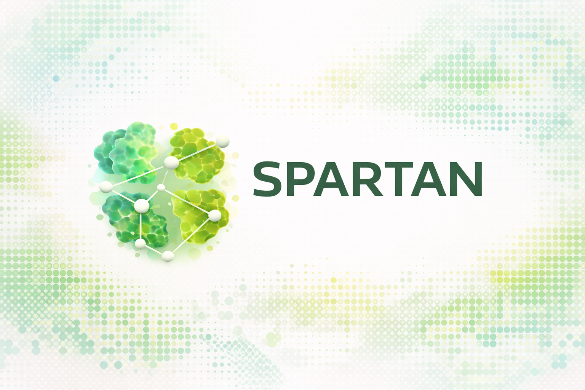
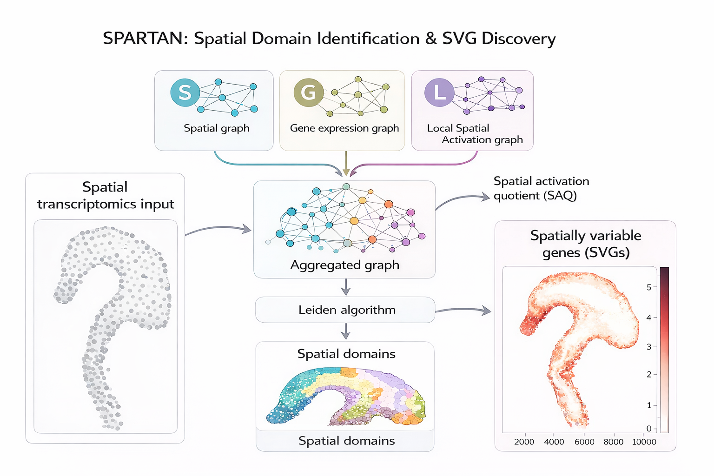

Spartan documentation
=====================

.. raw:: html

   

     Spartan is an activation-aware spatial transcriptomics framework for spatial domain
     identification and spatially variable gene discovery. Spartan integrates spatial topology,
     gene expression connectivity, and Local Spatial Activation (LSA) into an aggregated graph
     for unsupervised spatial domain detection. The framework is designed for multiple spatial
     transcriptomics technologies, including imaging-based datasets such as MERFISH,
     sequencing-based datasets such as Stereo-seq, and high-resolution platforms such as
     Visium HD. Spartan can operate on both classic AnnData and next-generation spatial omics,
     SpatialData frameworks.
   

.. toctree::
   :maxdepth: 2
   :caption: User guide

   overview
   installation
   quickstart
   recommended_parameters
   spatial_domains
   svg
   alpha_selection
   tutorials
   reproducibility
   data_availability
   citation

.. toctree::
   :maxdepth: 2
   :caption: Reference

   api
   cli
