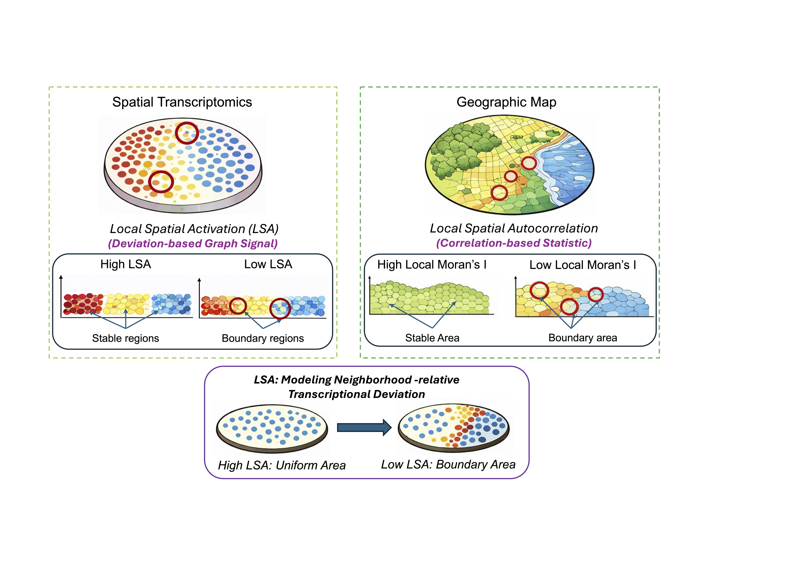

# Overview

<p style="text-align: justify; text-justify: inter-word;">
Spartan is an activation-aware spatial transcriptomics framework for identifying spatial domains and spatially variable genes in high-resolution spatially resolved transcriptomics data. It is designed for datasets where biologically meaningful tissue organization is not limited to large, clearly separated compartments, but also includes transitional zones, localized microstructures, boundary regions, and nested spatial microenvironments.
</p>

<p style="text-align: justify; text-justify: inter-word;">
Many spatial clustering approaches rely primarily on spatial proximity, gene-expression similarity, or spatial smoothing. These signals are useful for recovering broad anatomical compartments, but they can attenuate fine-scale local variation. In high-resolution spatial transcriptomics, important biological structures often appear as thin layers, curved boundaries, gradual transitions, or localized activation programs embedded inside larger tissue regions. Examples include epithelial–stromal interfaces, developmental transition zones, vascular niches, immune-enriched regions, and spatially restricted gene programs.
</p>

<p style="text-align: justify; text-justify: inter-word;">
Spartan addresses this problem using <strong>Local Spatial Activation (LSA)</strong>. LSA is a neighborhood-relative graph signal that measures how strongly neighboring cells or spots deviate from their local transcriptional context. Instead of only asking whether neighboring observations are similar, LSA asks whether local neighborhoods contain coordinated transcriptional activation or deviation relative to their surrounding tissue environment. This allows Spartan to preserve spatial coherence while remaining sensitive to localized molecular structure.
</p>

<p style="text-align: justify; text-justify: inter-word;">
Spartan addresses this problem using <strong>Local Spatial Activation (LSA)</strong>. LSA is a neighborhood-relative graph signal that measures how strongly neighboring cells or spots deviate from their local transcriptional context. Instead of only asking whether neighboring observations are similar, LSA asks whether local neighborhoods contain coordinated transcriptional activation or deviation relative to their surrounding tissue environment. This allows Spartan to preserve spatial coherence while remaining sensitive to localized molecular structure.
</p>

<p align="center">
  
</p>

<p align="center">
  <em>Conceptual comparison between Local Spatial Activation in spatial transcriptomics and local spatial autocorrelation in geographic maps. LSA models neighborhood-relative transcriptional deviation and highlights stable regions and boundary-associated activation patterns.</em>
</p>

Spartan constructs three complementary graph layers:

- **Spatial graph (`S`)**: captures physical neighborhood topology between nearby cells or spots.
- **Gene expression connectivity graph (`G`)**: captures transcriptomic similarity in PCA-reduced expression space.
- **Local Spatial Activation graph (`L`)**: captures neighborhood-conditioned transcriptional activation and local deviation structure.

These graphs are combined into an activation-aware aggregated graph:

```{math}
J = (\alpha-\beta_1)L + (1-\alpha)G + (\alpha-\beta_2)S
